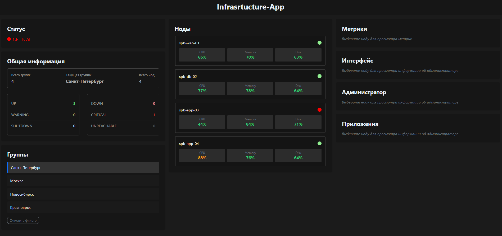

# 🖥 Enterprise Infrastructure Dashboard — Тестовое задание

## 🌟 Реализованный функционал

### 🧩 Основные возможности

-   **Динамическое отображение инфраструктуры** в виде трёхколоночного интерфейса
-   **Фильтрация по группам** с сохранением состояния в Redux
-   **Детализация нод** с графиками метрик (Chart.js)
-   **Автообновление данных** каждые 60 секунд

### 🛠 Технологический стек

| Технология        | Назначение                 |
| ----------------- | -------------------------- |
| **React 18**      | Базовый фреймворк          |
| **TypeScript**    | Статическая типизация      |
| **Redux Toolkit** | Централизованное состояние |
| **SCSS Modules**  | Модульные стили            |
| **Chart.js**      | Визуализация метрик        |
